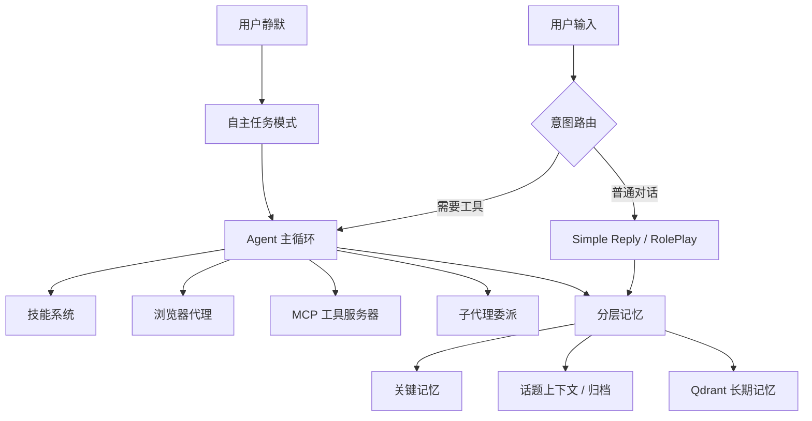

<div align="center">


# Selena

一个尽量待在你电脑里、会记事、会调工具、你不在时也会自己做点事的本地 AI Agent。

[](https://www.python.org/)
[](./LICENSE)
[](https://qdrant.tech/)
[](https://react.dev/)
[](https://modelcontextprotocol.io/)

**[文档入口](./docs/README.md)** ·
**[快速开始](#快速开始)** ·
**[部署说明](./DEPLOYMENT.md)** ·
**[配置参考](./CONFIG_REFERENCE.md)** ·
**[贡献指南](./CONTRIBUTING.md)**

</div>

***

## 这项目是干嘛的

Selena 不是“换个皮的聊天框”。

它更像一个本地 AI companion / agent runtime：能记住长期上下文、会判断一句话到底该普通回复还是开 Agent、能接浏览器和 MCP 工具、还能在你暂时离开时自己跑一轮任务。

如果你想研究“一个相对完整的本地 Agent 系统到底长什么样”，这个仓库就是朝这个方向慢慢堆出来的。

## 现在已经能做的事

- `分层记忆`：关键记忆、话题上下文、Qdrant 向量长期记忆一起工作，不是聊完就失忆。
- `意图路由`：先判断这一句值不值得进 Agent 模式，避免每句话都上大模型重武器。
- `Agent 主循环`：带 token 预算、连续调用限制、工具结果压缩和检索缓存复用。
- `技能系统`：除了内置技能，还支持把重复工具流沉淀成可复用技能。
- `浏览器代理`：通过 CDP 控制浏览器做导航、点击、截图和跨标签页协作。
- `子代理并行`：可以把调研、规划、review、test 之类的任务拆给多个子代理。
- `自主任务模式`：用户静默时自动规划任务、执行、打分享分，回来再找机会提一嘴。
- `Web 工作台`：React + TypeScript 前端，方便看状态、调配置、追踪调用。

## 快速开始

> 前置要求：Python 3.9+、Docker 20.10+。如果你想手动跑前端，再准备一个 Node.js 18+。

```bash
git clone <your-repo-url>
cd Selena

cp config.example.json config.json
# 把里面的 API Key 占位符替换成真实值

python -m venv .venv
# Windows PowerShell
.venv\Scripts\Activate.ps1

pip install --upgrade pip
pip install -r requirements.txt

docker compose up -d

python -m DialogueSystem.main
```

如果你想单独启动前端：

```bash
cd DialogueSystem/frontend
pnpm install
pnpm dev
```

默认地址：

| 服务               | 地址                                |
| ---------------- | --------------------------------- |
| Web 工作台          | <http://127.0.0.1:5173>           |
| 本地 API           | <http://127.0.0.1:8000>           |
| Qdrant Dashboard | <http://127.0.0.1:6333/dashboard> |

补充两句：

- `config.json` 不应该提交到公共仓库，仓库里保留的是 `config.example.json`。
- 如果 `Frontend.auto_start = true`，主程序会尝试自动拉起前端开发服务器。
- 更完整的环境隔离、Docker、生产部署说明在 [DEPLOYMENT.md](./DEPLOYMENT.md)。

## 架构一眼看懂



更细的架构说明可以直接翻这些文档：

- [docs/architecture.md](./docs/architecture.md)
- [docs/agent-loop.md](./docs/agent-loop.md)
- [docs/intent-routing.md](./docs/intent-routing.md)
- [docs/memory-system.md](./docs/memory-system.md)
- [docs/skill-system.md](./docs/skill-system.md)

## 仓库怎么逛

```text
DialogueSystem/           主运行时：Agent、记忆、浏览器、MCP、前端 API
DialogueSystem/frontend/  React + TypeScript 工作台
docs/                     面向公开仓库的文档
CONFIG_REFERENCE.md       config.json 字段说明
DEPLOYMENT.md             部署与运行说明
docker-compose.yml        Qdrant 启动配置
```

如果你是第一次进仓库，建议按这个顺序看：

1. 先看这份 README，知道项目大概在干嘛。
2. 再看 [DEPLOYMENT.md](./DEPLOYMENT.md)，把环境真的跑起来。
3. 然后按兴趣去读 [docs/README.md](./docs/README.md) 里的模块文档。
4. 想改代码的话，再看 [DialogueSystem/README.md](./DialogueSystem/README.md)。

## 贡献、讨论和反馈

- 想修 bug、补文档、加新技能、改体验，都欢迎。
- 提 PR 前先看看 [CONTRIBUTING.md](./CONTRIBUTING.md)，能少来回很多。
- 安全问题不要直接公开发 issue，先看 [SECURITY.md](./SECURITY.md)。
- 社区协作边界写在 [CODE\_OF\_CONDUCT.md](./CODE_OF_CONDUCT.md)。

## 路线图

- [x] 分层记忆
- [x] 意图路由
- [x] Agent 主循环
- [x] 浏览器代理
- [x] 子代理并行委派
- [x] MCP 集成
- [x] React 工作台
- [x] Docker 化 Qdrant
- [ ] 更完整的自动化测试与 CI
- [ ] 更清晰的 release 节奏
- [ ] 更多稳定的 demo / example workflows

## 协议

本项目使用 [Apache License 2.0](./LICENSE)。

可以商用、可以修改、可以分发，也带专利许可。你要是真拿它做了点有意思的东西，欢迎告诉我一声。
