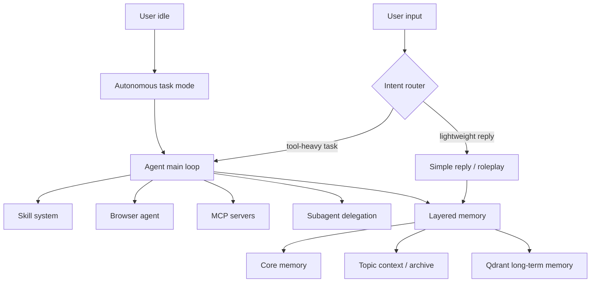

[简体中文](./README.zh-CN.md)

<div align="center">


# Selena

A local-first AI agent that remembers context, decides when to use tools, and can keep working when you step away.

[](https://www.python.org/)
[](./LICENSE)
[](https://qdrant.tech/)
[](https://react.dev/)
[](https://modelcontextprotocol.io/)

**[Docs](./docs/README.md)** ·
**[Quick Start](#quick-start)** ·
**[Deployment](./DEPLOYMENT.md)** ·
**[Config Reference](./CONFIG_REFERENCE.md)** ·
**[Contributing](./CONTRIBUTING.md)**

</div>

---

## What Selena is

Selena is not just a chat window with a nicer prompt.

It is a local AI agent runtime: it keeps layered memory, routes requests between normal dialogue and agent mode, talks to browsers and MCP tools, and can run autonomous tasks while you are away.

If you want to study what a relatively complete local agent system looks like in practice, this repository is meant to be a real, editable example.

## What it already does

- `Layered memory`: core memory, live topic context, and long-term vector memory work together.
- `Intent routing`: decides whether a message needs the full agent loop or just a lightweight reply.
- `Agent loop`: includes tool-call budgets, repeated-call guards, result compression, and retrieval cache reuse.
- `Skill system`: supports built-in skills and turning repeated tool flows into reusable skills.
- `Browser agent`: drives browsers through CDP for navigation, interaction, screenshots, and multi-tab work.
- `Subagents`: parallel delegation for research, planning, review, testing, and more.
- `Autonomous mode`: plans and executes tasks when the user is idle, then decides whether the result is worth sharing later.
- `Web workbench`: a React + TypeScript frontend for chat, debugging, configuration, and observability.

## Quick start

> Requirements: Python 3.9+, Docker 20.10+, and at least one working LLM provider key. If you want to run the frontend manually, also install Node.js 18+.

```bash
git clone <your-repo-url>
cd Selena

cp config.example.json config.json
# Replace the placeholder API keys in config.json

python -m venv .venv
# Windows PowerShell
.venv\Scripts\Activate.ps1

pip install --upgrade pip
pip install -r requirements.txt

docker compose up -d

python -m DialogueSystem.main
```

To run the frontend separately:

```bash
cd DialogueSystem/frontend
pnpm install
pnpm dev
```

Default addresses:

| Service | Address |
| --- | --- |
| Web workbench | <http://127.0.0.1:5173> |
| Local API | <http://127.0.0.1:8000> |
| Qdrant dashboard | <http://127.0.0.1:6333/dashboard> |

Notes:

- `config.json` should stay local. The repository keeps `config.example.json` as the public template.
- If `Frontend.auto_start = true`, the backend will try to start the frontend dev server automatically.
- More setup and production notes live in [DEPLOYMENT.md](./DEPLOYMENT.md).

## Architecture at a glance



Start here if you want the deeper design docs:

- [docs/architecture.md](./docs/architecture.md)
- [docs/agent-loop.md](./docs/agent-loop.md)
- [docs/intent-routing.md](./docs/intent-routing.md)
- [docs/memory-system.md](./docs/memory-system.md)
- [docs/skill-system.md](./docs/skill-system.md)

## Repository map

```text
DialogueSystem/           Main runtime: agent, memory, browser, MCP, frontend API
DialogueSystem/frontend/  React + TypeScript workbench
docs/                     Public project docs
CONFIG_REFERENCE.md       config.json field reference
DEPLOYMENT.md             setup and deployment guide
docker-compose.yml        Qdrant service definition
```

Recommended reading order:

1. Read this README for the big picture.
2. Use [DEPLOYMENT.md](./DEPLOYMENT.md) to get the project running.
3. Browse [docs/README.md](./docs/README.md) for subsystem-level explanations.
4. If you plan to edit the runtime, read [DialogueSystem/README.md](./DialogueSystem/README.md).

## Open-source readiness: what still deserves work

The project is already shareable, but these items would make outside adoption smoother:

- `CI`: at least frontend type-check/build plus a backend smoke test.
- `Public tests`: the current test material still needs cleanup for external contributors.
- `Release + changelog`: people should not have to track `main` forever.
- `Demo GIFs and screenshots`: the repo now has a proper default English README, but a quick visual walkthrough would help a lot.
- `Further main.py decomposition`: the main runtime entry is still large for first-time contributors.
- `Repository cleanup`: tracked backup files like `README.md.backup` should be removed before a wider public push.

## Contributing and feedback

- Bug fixes, docs improvements, new skills, and UX work are all welcome.
- Read [CONTRIBUTING.md](./CONTRIBUTING.md) before opening a PR.
- Report security issues privately first; see [SECURITY.md](./SECURITY.md).
- Collaboration expectations live in [CODE_OF_CONDUCT.md](./CODE_OF_CONDUCT.md).

## Roadmap

- [x] Layered memory
- [x] Intent routing
- [x] Agent main loop
- [x] Browser agent
- [x] Parallel subagent delegation
- [x] MCP integration
- [x] React workbench
- [x] Dockerized Qdrant
- [ ] More automated testing and CI
- [ ] Clearer release cadence
- [ ] More stable demo and example workflows

## License

This project is released under [Apache License 2.0](./LICENSE).

Commercial use, modification, and redistribution are allowed, and the license includes a patent grant. If you build something interesting on top of Selena, I would genuinely love to hear about it.
