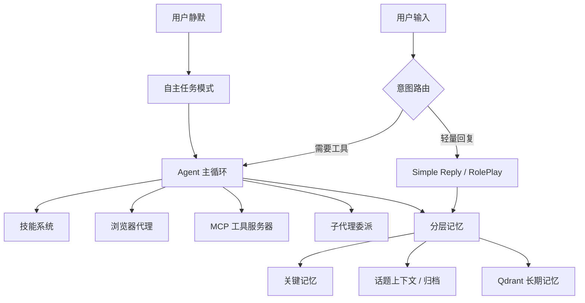

[English](./README.md)

<div align="center">


# Selena

一个尽量待在你电脑里、会记事、会调工具、你不在时也会自己做点事的本地 AI Agent。

[](https://www.python.org/)
[](./LICENSE)
[](https://qdrant.tech/)
[](https://react.dev/)
[](https://modelcontextprotocol.io/)

**[文档中心](./docs/zh-CN/README.md)** ·
**[快速开始](#快速开始)** ·
**[部署说明](./DEPLOYMENT.zh-CN.md)** ·
**[配置参考](./CONFIG_REFERENCE.zh-CN.md)** ·
**[贡献指南](./CONTRIBUTING.zh-CN.md)**

</div>

---

## 这项目是干嘛的

Selena 不只是一个聊天界面。

它更像一个本地 AI companion / agent runtime：能记住长期上下文、会判断一句话该普通回复还是进入 Agent 模式、能调用浏览器和 MCP 工具，也能在你暂时离开时做一些有边界的自主任务。

如果你想研究“一个相对完整的本地 Agent 系统到底怎么搭”，这个仓库就是面向这个方向持续迭代的实践版本。

## 现在已经能做的事

- `分层记忆`：关键记忆、当前话题上下文、长期向量记忆协同工作。
- `意图路由`：先判断要不要进入 Agent，而不是每句话都上重流程。
- `Agent 主循环`：带工具调用预算、重复调用限制、结果压缩和检索缓存。
- `技能系统`：支持内置技能，也支持把重复工具流沉淀成可复用技能。
- `浏览器代理`：通过浏览器运行时做导航、点击、截图和跨标签页操作。
- `子代理并行`：适合调研、规划、review、test 一类可分支任务。
- `自主任务模式`：用户静默时规划并执行小任务，再判断值不值得下次提及。
- `Web 工作台`：React + TypeScript 前端，方便看状态、调配置、做调试。

## 快速开始

> 前置要求：Python 3.9+、Docker 20.10+。如果要手动运行前端，再准备 Node.js 18+。

```bash
git clone <your-repo-url>
cd Selena

cp config.example.json config.json
# 把里面的 API Key 占位符替换成真实值

python -m venv .venv
.venv\Scripts\Activate.ps1

pip install --upgrade pip
pip install -r requirements.txt

docker compose up -d

python -m DialogueSystem.main
```

如果你想单独启动前端：

```bash
cd DialogueSystem/frontend
pnpm install
pnpm dev
```

默认地址：

| 服务 | 地址 |
| --- | --- |
| Web 工作台 | <http://127.0.0.1:5173> |
| 本地 API | <http://127.0.0.1:8000> |
| Qdrant Dashboard | <http://127.0.0.1:6333/dashboard> |

补充两句：

- `config.json` 应该只保留在本地，仓库中公开的是 `config.example.json`。
- 如果 `Frontend.auto_start = true`，后端会尝试自动拉起前端开发服务器。
- 更完整的部署说明请看 [DEPLOYMENT.zh-CN.md](./DEPLOYMENT.zh-CN.md)。

## 架构一眼看懂



更细的中文文档入口见 [docs/zh-CN/README.md](./docs/zh-CN/README.md)。

## 仓库怎么逛

```text
DialogueSystem/           主运行时：Agent、记忆、浏览器、MCP、前端 API
DialogueSystem/frontend/  React + TypeScript 工作台
docs/                     英文默认公开文档
docs/zh-CN/              中文镜像文档
CONFIG_REFERENCE.zh-CN.md 配置项中文参考
DEPLOYMENT.zh-CN.md       中文部署说明
```

## 作为开源项目，接下来还建议补这些

- `CI`：至少前端 type check / build，再加一个后端 smoke test。
- `公开测试样例`：当前测试内容还需要再整理。
- `release + CHANGELOG`：方便外部使用者锁版本。
- `Demo GIF / 截图`：现在有默认英文首页了，但还缺更直观的产品演示。
- `进一步拆分 main.py`：新贡献者第一次阅读会更轻松。
- `仓库清理`：像 `README.md.backup` 这类已跟踪备份文件建议移除。

## 协议

本项目使用 [Apache License 2.0](./LICENSE)。
