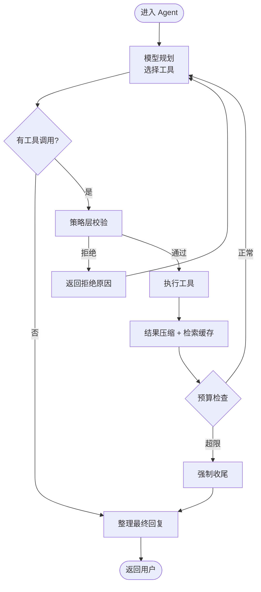

# 🤖 Agent 主循环

> 意图路由判定"需要工具"之后，控制权交给 Agent 主循环。这一层负责：**让模型自主选择工具、执行、整理结果，并知道在什么时候该停下来**。

---

## 1. 主循环骨架



---

## 2. 三道预算闸门

任何 Agent 跑长链路都有"跑飞"的风险。Selena 用三道闸门控制：

### ① `AgentRuntime.max_tool_calls`
单轮工作流允许的工具调用总数上限（默认 50）。超过即强制收尾。

### ② `AgentRuntime.max_consecutive_same_tool_calls`
同一个工具连续调用达到此次数后，认为模型在"卡住打转"，强制收尾（默认 20）。

### ③ Token 预算
通过 `agent/token_counter.py` 持续估算累计输入/输出 token。接近上限时主循环会优先压缩历史而非追加新工具调用。

---

## 3. 工具规划阶段

主循环每次让模型决策时给它三样东西：

1. **当前对话上下文**（已经过摘要压缩）
2. **可用工具清单**（按 `enabled_toolsets` 过滤）
3. **角色与目标提示词**（来自 `MdFile/agent/AgentPrompt.md`）

模型返回 OpenAI 兼容的 `tool_calls` 数组：

```json
{
  "tool_calls": [
    { "name": "webSearch", "arguments": { "query": "..." } },
    { "name": "searchLongTermMemory", "arguments": { "query": "..." } }
  ]
}
```

支持**并行工具调用** —— 主循环检测到多个工具调用时会并发执行（除非工具被标记为互斥）。

---

## 4. 安全策略层 ToolPolicyEngine

工具调用 → 真正执行之间，先经过 [`policy/tool_policy.py`](../DialogueSystem/policy/tool_policy.py) 校验：

| 检查项 | 拒绝条件 |
|--------|---------|
| 工具集启用 | 工具所属 toolset 不在 `Security.enabled_toolsets` 中 |
| 文件路径合法 | 文件操作工具的目标路径不在 `Security.file_roots` 内 |
| 管理员权限 | 工具需要 admin 但 `Security.is_admin = false` |
| 审批模式 | `approval_mode = manual` 且工具未在 `approved_tools` 中 |
| 终端执行 | `allow_local_terminal = false` 时禁用本地终端后端 |

被拒绝的调用不会真的执行 —— 模型会收到拒绝原因，自己决定换路或放弃。

---

## 5. 工具结果处理

### 自动压缩
检索类工具（webSearch、searchLongTermMemory 等）的返回往往很长。主循环会用 `summarizeToolResults` 工具或 `context_summary` 模型对超长结果做压缩：

- 保留来源 / 关键事实 / 关键引用。
- 去掉冗余措辞与分隔符。

### 检索缓存（AgentRetrievalCache）
检索类工具的结果会自动入缓存：

```
缓存键 = (工具名, 归一化参数)
缓存值 = 结果文本
```

下次出现"相似问题"时（由 `match_model` 判断），可以**直接复用缓存而不再调用工具**。这套机制对追问场景（"刚才那个再展开讲讲"）效果特别好。

可缓存的工具白名单见 `AgentRetrievalCache.cacheable_tools`：

```
webSearch, webFetch, browserExtractPage,
readAutonomousTaskArtifact, searchAutonomousTaskArtifacts,
searchLongTermMemory, searchFullText, readLocalFile
```

---

## 6. 多模型分工

不是所有阶段都用同一个模型。`ModelSelect` 让你按任务路由：

| 任务 | 推荐特性 | 默认配置示例 |
|------|---------|-------------|
| `Agent` | 工具规划，需要好的 reasoning | `deepseek_flash` + thinking + max effort |
| `Simple` | 普通回复 | `deepseek_pro` |
| `RolePlay` | 人设回复 | `deepseek_pro` |
| `LiteraryCreation` | 长文本创作 | `deepseek_pro` + thinking |
| `SummaryAndMermory` | 摘要生成 | `deepseek_pro` + json_mode |
| `topic_same` | 二分判定，要快 | `deepseek_flash` + json_mode |
| `LLMIntentRouter` | 灰区复核，要快 | `qwen_flash` + json_mode |

字段含义详见 [`CONFIG_REFERENCE.md`](../CONFIG_REFERENCE.md#modelselect)。

---

## 7. 上下文压缩策略

```
Live context 长度 > Summary.Max_context (默认 100)
  → 触发压缩
  → 保留最近 Summary.Summary_context (默认 70) 条原始消息
  → 之前的内容压缩成摘要

Agent 流程内部：
  → 工具结果 + 思考链 + 中间消息 全部计入
  → 上限 Summary.Agent_Max (默认 6)
```

压缩用的是 `context_summary` 模型，通常配 thinking + 中等 reasoning effort。

---

## 8. 子代理委派

主 Agent 可以通过 [子代理委派](./subagent-delegation.md) 把"子任务"丢给隔离的 sub-agent。这是另一种预算控制 —— 子代理跑挂了不影响主链路。

---

## 9. 工具展示与审批 UI

`agent/tool_rendering.py` 负责把工具调用渲染成对用户友好的格式：

```
[🔧 webSearch] 正在搜索：Mamba 架构与 Transformer 对比
[✅ webSearch] 找到 8 条结果，已压缩到 1200 字
[🔧 generateDocument] 正在导出 PDF...
[✅ generateDocument] 已生成 mamba_vs_transformer.pdf
```

`approval_mode = manual` 时，高风险工具会以审批 UI 的形式弹出（前端通过 `resolveToolApproval` 工具回写决定）。

---

## 10. 相关文档

- [意图路由](./intent-routing.md) — 上一站
- [子代理委派](./subagent-delegation.md) — Agent 的递归
- [安全策略](./security-policy.md) — ToolPolicyEngine 详解
- [技能系统](./skill-system.md) — 工具与 skill 的关系
