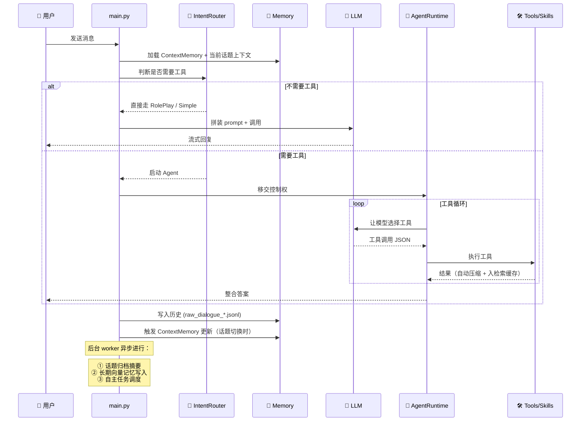

# 🏗️ 整体架构

> Selena 是一套**模块化的本地 AI Agent 运行时**。本篇说明各模块边界、数据流与扩展点。

---

## 1. 三层架构

Selena 自底向上分为三层：

```
┌─────────────────────────────────────────────────────────────┐
│  🎨 Presentation Layer — 表现层                              │
│  ├─ Web 工作台 (React + TypeScript)                          │
│  ├─ 终端 REPL（main.py 标准输入）                            │
│  └─ 本地 HTTP API (Frontend.api_port)                        │
├─────────────────────────────────────────────────────────────┤
│  🧠 Cognitive Layer — 认知层                                 │
│  ├─ 意图路由 IntentRouter                                    │
│  ├─ Agent 主循环 AgentRuntime                                │
│  ├─ 子代理委派 SubAgentRuntime                               │
│  ├─ 自主任务 AutonomousExecutor                              │
│  ├─ 分层记忆 ContextMemory / ChatContext / TopicHistory      │
│  └─ 技能系统 SkillManager                                    │
├─────────────────────────────────────────────────────────────┤
│  🛠️ Capability Layer — 能力层                                │
│  ├─ LLM 调用封装 (qwen / kimi / minimax / deepseek …)         │
│  ├─ Embedding & Rerank 服务                                  │
│  ├─ Qdrant 向量库 (MemorySystem.Qdrant)                      │
│  ├─ 浏览器控制 (Chrome / Edge / Firefox via CDP)              │
│  ├─ MCP 客户端 (MCP.runtime)                                 │
│  └─ 文件 / 终端 / 日程 等本地工具                             │
└─────────────────────────────────────────────────────────────┘
```

各层只能向下依赖。表现层不直接访问 Qdrant；能力层不知道有 Agent 的存在。

---

## 2. 一次对话的完整数据流



---

## 3. 核心模块

### 3.1 入口与编排

| 模块 | 路径 | 职责 |
|------|------|------|
| 主入口 | `DialogueSystem/main.py` | 顶层运行循环，意图路由、模型选择、上下文拼装、tool 调用编排 |
| 包导出 | `DialogueSystem/__init__.py` | 公共 API |
| 路径与资源 | `DialogueSystem/config/` | 统一管理 prompt / tool / skill 静态资源加载 |

### 3.2 认知核心

| 模块 | 路径 | 职责 |
|------|------|------|
| Agent 主循环 | `agent/agent_runtime.py` | 工具规划、token 预算、连续调用限制 |
| 会话 | `agent/agent_session.py` | Agent 跨轮次状态 |
| 子代理 | `agent/subagent_runtime.py` | 委派型 Agent 的隔离执行 |
| Token 计算 | `agent/token_counter.py` | 多模型 token 预估 |
| 自主任务 | `autonomous/autonomous_executor.py` | 用户空闲时的后台规划与执行 |
| 自主任务日志 | `autonomous/autonomous_task_log.py` | SQLite 持久化任务历史 |

### 3.3 记忆系统

| 模块 | 路径 | 职责 |
|------|------|------|
| 关键记忆 | `memory/ChatContext.py` | always-visible 的 ContextMemory |
| 话题历史 | `memory/topic_history.py` | 当前话题与历史话题归档 |
| 长期记忆存储 | `memory/memory_storage.py` | 本地 JSON 状态 + Qdrant 向量库 |
| 历史摘要 worker | `memory/history_summary_worker.py` | 后台异步摘要 |
| Qdrant 封装 | `MemorySystem/Qdrant.py` | 向量库底层操作（项目唯一向量库依赖） |

### 3.4 技能与工具

| 模块 | 路径 | 职责 |
|------|------|------|
| 技能管理 | `skill_system/skill_manager.py` | 装载、启用、CRUD |
| 技能市场 | `skill_system/skill_marketplace.py` | 浏览/导入/导出 |
| 技能演化 | `skill_system/skill_runtime.py` | 工具流模式识别 → 沉淀新技能 |
| 工具元数据 | `policy/tool_metadata.py` | 工具集分组与元信息 |
| 安全策略 | `policy/tool_policy.py` | ToolPolicyEngine，运行时审批与权限判定 |
| 动态工具 | `runtime/dynamic_tools.py` | 运行时注入的工具 |
| MCP 桥接 | `runtime/mcp_runtime.py` | MCP 服务器集成 |

### 3.5 外部能力

| 模块 | 路径 | 职责 |
|------|------|------|
| LLM 调用 | `llm/` | OpenAI 兼容协议封装 |
| 浏览器控制 | `browser/browser_control.py` 等 | 通过 CDP 操控 Chrome / Edge / Firefox |
| 日程系统 | `services/schedule_system.py` | 提醒任务的 SQLite CRUD |
| 前端 API | `runtime/frontend_runtime.py` | 给 Web 工作台提供本地 API |

### 3.6 安全模块

| 模块 | 路径 | 职责 |
|------|------|------|
| 子代理策略 | `security/subagent_policy.py` | 委派任务的资源/工具限制 |
| Prompt 注入防护 | `security/prompt_injection.py` | 检测注入特征 |
| 数据脱敏 | `security/redaction.py` | 敏感信息脱敏 |
| 检查点 | `security/checkpoint.py` | 高风险操作前的人工审批点 |

---

## 4. 数据持久化布局

```
DialogueSystem/
├─ data/                              # SQLite 数据库与浏览器 profile（gitignored）
│   ├─ persistent_core_memory.json    # ContextMemory 持久化
│   ├─ schedule.db                    # 日程任务
│   ├─ autonomous_tasks.db            # 自主任务历史
│   ├─ skill_evolution.db             # 技能演化记录
│   └─ browser-profile/               # 浏览器持久化 profile
├─ history/                           # 对话历史（gitignored）
│   ├─ raw_dialogue_<topicGroup>.jsonl
│   └─ .summary_memory_state.json
├─ logs/                              # 运行日志（gitignored）
│   ├─ dialogue_system.log
│   └─ history_summary_worker.log
qdrant_data_docker/                   # Qdrant 向量库（gitignored）
```

---

## 5. 后台异步任务

Selena 中有几条**独立运行的后台流水线**，不会阻塞主对话：

| Worker | 触发时机 | 任务内容 |
|--------|---------|---------|
| 历史摘要 worker | 每次 topic 切换 | 把旧话题原始消息压缩成档案摘要 |
| 长期记忆写入 | Agent / 主回复完成后 | 抽取需要长期记忆的语义点 → 向量化 → 写 Qdrant |
| ContextMemory 刷新 | 按 `update_trigger` 配置 | 重写 always-visible 关键记忆 |
| 自主任务调度 | 用户静默 ≥ `idle_threshold_seconds` | 规划今日目标 → 选一个执行 |
| 分享分评估 | 自主任务完成后 | 给经历打分，决定是否值得提及 |
| 静默跟进 | 用户静默时长达到阈值 | 主动生成跟进文案 |

---

## 6. 扩展点

如果你想扩展 Selena，最常见的入口：

| 想做什么 | 改哪里 |
|----------|--------|
| 加一个新工具 | 在 `tools/` 加 JSON 定义，在主循环对应分支处理 |
| 加一个新技能 | 在 `skills/<name>/` 创建 `manifest.json` + `runtime.py` |
| 接入新 LLM 供应商 | 在 `config.json` 的 `LLM_Setting.providers` 加一项（OpenAI 兼容协议） |
| 接入外部工具服务 | 在 `MCP.servers` 加一个 MCP 服务器 |
| 自定义角色人格 | 改 `MdFile/dialogue/RolePlayPrompt.md` 与 `config.json` 的 `Character` 字段 |
| 自定义子代理类型 | 在 `agents/` 添加 `<name>.md` |

---

## 7. 相关文档

- [Agent 主循环](./agent-loop.md)
- [意图路由](./intent-routing.md)
- [分层记忆系统](./memory-system.md)
- [技能系统](./skill-system.md)
