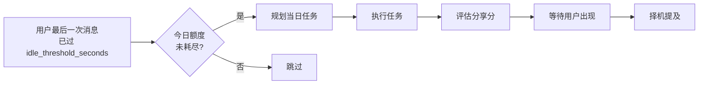
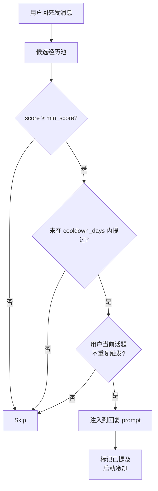

# 🌙 自主任务模式

> **当用户不在的时候，Selena 在做什么？** —— 这是 Selena 区别于普通 ChatBot 的关键能力。

---

## 1. 设计动机

传统 AI 助手只在被问到时才工作。但人类伙伴不是这样：

> 朋友会在你睡觉时记得帮你查一下明天的天气；
> 同事会在你不在时把还没看的报告读完；
> 家人会在你忙的时候自己找点事做。

自主任务模式（Autonomous Task Mode，简称 **ATM**）让 Selena 在你不在的时候**主动找事做**，并在你回来时择机分享。

---

## 2. 触发条件



| 条件 | 来自配置 |
|------|---------|
| 用户静默 ≥ `idle_threshold_seconds` | 默认 300 秒 |
| 当日已执行任务 < `max_daily_tasks` | 默认 3 |
| 当日被打断次数 < `max_daily_interrupts` | 默认 2 |
| 单任务尝试次数 < `max_task_attempts` | 默认 3 |

---

## 3. 三阶段流水线

### 阶段 1：任务规划

进入自主模式后，先用 `task_planning` 模型生成一份"今日要做的事情"：

```
基于当前关键记忆 + 最近对话 + 历史已完成任务，规划 1~3 个：
  - 你（Selena）自己想做的事
  - 不需要用户参与就能完成
  - 完成后愿意分享给用户
```

输出示例：
```json
{
  "tasks": [
    {
      "title": "看一下昨天讨论过的 RAG 论文进展",
      "rationale": "用户上周提到对这个方向感兴趣"
    },
    {
      "title": "写一段关于'安静'的随笔",
      "rationale": "这是我自己想写的"
    }
  ]
}
```

提示词在 `MdFile/agent/AutonomousTaskPlanPrompt.md`。

### 阶段 2：任务执行

每个任务用一个 `autonomous` 类型的子代理执行（详见 `agents/autonomous.md`）：

| 限制 | 原因 |
|------|------|
| 不能 askUser | 用户不在场 |
| 不能 resolveToolApproval | 没人审批 |
| 不能 delegateTask | 避免递归创建任务 |
| 不能写文件 / 跑终端 | 安全考量 |
| 不能 storeLongTermMemory | 避免污染长期记忆 |
| 不能修改 skill / 刷新 MCP | 防止改坏运行时 |

允许的：读文件、看日程、浏览网页、搜索、思考、整理。

### 阶段 3：分享分评估

任务完成后，用 `sharing_score` 模型给"经历"打分：

```json
{
  "sharing_score": 0.78,
  "rationale": "用户对这个话题表达过兴趣，且任务有具体产出",
  "summary": "我刚刚读完了那篇论文，发现作者其实承认了一个限制..."
}
```

---

## 4. 分享与冷却机制

不是所有自主经历都该立刻告诉用户。`sharing` 配置控制提及策略：

```json
{
  "sharing": {
    "min_score": 0.5,
    "cooldown_days": 7,
    "max_inject_count": 1,
    "mention_detection": {
      "embedding_threshold": 0.85,
      "keyword_min_hits": 2
    }
  }
}
```

### 注入逻辑



`max_inject_count = 1` 表示一轮回复最多只主动提及 1 条经历，避免"列流水账"。

### 提及检测
为了避免反复说同一件事，系统会用两种方式判断"这件事是不是已经讲过"：

- **Embedding 相似度**：当前回复 vs 经历摘要 ≥ `embedding_threshold` → 视为已提及。
- **关键词重叠**：核心关键词命中数 ≥ `keyword_min_hits` → 视为已提及。

提及后，该经历进入 `cooldown_days` 冷却期，期内不再候选。

---

## 5. 资源预算

token 控制非常严格：

```json
{
  "token_limits": {
    "max_input_tokens_per_session": 200000,
    "max_output_tokens_per_session": 50000,
    "max_input_tokens_per_task": 80000,
    "max_output_tokens_per_task": 20000
  }
}
```

| 维度 | 含义 |
|------|------|
| **per_session** | 单日（一次自主会话）总预算 |
| **per_task** | 单任务预算 |

预算耗尽后当日不再执行新任务。

---

## 6. 任务持久化

所有自主任务都写入 `DialogueSystem/data/autonomous_tasks.db`，记录：

| 字段 | 含义 |
|------|------|
| `task_id` | 唯一 ID |
| `title` / `rationale` | 任务描述 |
| `attempts` | 尝试次数 |
| `status` | running / completed / failed / cancelled |
| `summary` | 完成后的摘要 |
| `artifacts` | 产物（如随笔原文、笔记） |
| `sharing_score` | 分享分 |
| `mentioned_at` | 已提及的时间戳 |
| `created_at` / `completed_at` | 时间戳 |

`atm-memory-inspector` skill 的 `searchAutonomousTaskArtifacts` 和 `readAutonomousTaskArtifact` 工具就是查询这个库的。

---

## 7. 一个完整例子

```
[18:45] 用户最后发：今天有点累，先去躺会儿。
[18:50] 5 分钟静默 → 触发自主模式

[ATM 规划]
  Task 1: 看下用户上次提到的"复杂度理论"是否有新论文
  Task 2: 整理一下最近三天的关键记忆
  Task 3: 写一首关于"疲惫"的小诗

[ATM 执行 Task 1]
  → searchWeb("complexity theory 2026")
  → 找到 3 篇相关 → 阅读摘要
  → 写出 200 字摘要笔记

[ATM 执行 Task 3]
  → 思考、写诗、修改
  → 保存到 artifacts

[分享分评估]
  Task 1: 0.65（专业内容，用户感兴趣过）
  Task 2: 0.40（流水账，不值得主动说）  → 不进候选
  Task 3: 0.82（情感共振，自我表达）

[19:30] 用户回来：唉，刚睡了一会儿。
  → 注入 Task 3（最高分）
[Selena] 嗯，你睡的时候我写了一首小诗。
        关于「疲惫」。要听吗？
```

如果用户说"要"，系统会调用 `readAutonomousTaskArtifact` 读出诗的原文 —— **不是即兴生成**，而是真的读那时写下的内容。

---

## 8. 关闭自主模式

如果你不想要这个能力（例如电费 / API 费用考虑）：

```json
{
  "AutonomousTaskMode": {
    "enabled": false
  }
}
```

或者只想关闭分享：

```json
{
  "sharing": {
    "min_score": 1.0
  }
}
```

`min_score = 1.0` 永远不达标，等于关闭主动提及，但任务仍会执行（数据可后续手动查看）。

---

## 9. 调参建议

| 你想要 | 怎么调 |
|--------|--------|
| 自主任务更频繁 | 调低 `idle_threshold_seconds`、调高 `max_daily_tasks` |
| 自主任务更克制 | 调高 `idle_threshold_seconds`、调低 `max_daily_tasks` |
| 主动提及更激进 | 调低 `min_score`、调短 `cooldown_days` |
| 主动提及更含蓄 | 调高 `min_score`、调长 `cooldown_days`、`max_inject_count = 0` |
| 单任务跑得更深 | 调高 `task_execution.max_tool_calls` 与 `max_input_tokens_per_task` |

---

## 10. 相关文档

- [子代理委派](./subagent-delegation.md) — autonomous 是一种特殊的 agent 类型
- [分层记忆系统](./memory-system.md) — 自主经历会被关联到记忆
- [技能系统](./skill-system.md#-atm-memory-inspector) — atm-memory-inspector 用于查询 ATM 产物
- [安全策略](./security-policy.md) — autonomous agent 的工具限制
