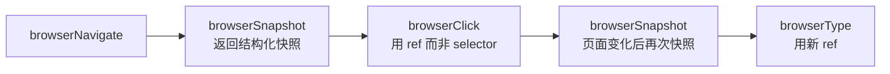

# 🌐 浏览器代理

> Selena 的浏览器控制不依赖 Playwright 或 Selenium，而是直接通过 **Chrome DevTools Protocol (CDP)** 操控本地浏览器，**让你看着它操作**。

---

## 1. 设计哲学

| 不是这样 | 而是这样 |
|---------|---------|
| 后台 headless 浏览器 | **前台可见**的真实浏览器 |
| 通过 selector 猜元素 | 通过 **快照 + ref** 精确定位 |
| 一次性脚本 | **持久化 profile**，cookies / 登录态保留 |
| 单标签 | **多标签页**协调 |

让用户**看到**浏览器在做什么，是有意为之 —— 这既是透明度，也是安全感。

---

## 2. 支持的浏览器

| 浏览器 | 文件 | 状态 |
|--------|------|------|
| **Chrome** | `browser/chrome_browser.py` | ✅ 主要支持 |
| **Edge** | `browser/edge_media.py` | ✅ 支持 |
| **Firefox** | `browser/firefox_browser.py`, `firefox_media.py` | ✅ 支持 |

底层共用 `browser/browser_control.py` 的抽象，通过 CDP / WebSocket 通信，**不需要额外安装 driver**。

---

## 3. Snapshot-Based 操作模式

传统浏览器自动化的痛点是 **selector 易碎** —— `#login-btn` 改个名整个脚本就废了。

Selena 用的是 snapshot 模式：



### 快照长什么样
```
[ref:b3c1] <button> 登录
[ref:b3c2] <input type="text" placeholder="用户名">
[ref:b3c3] <input type="password">
[ref:b3c4] <a href="/forgot"> 忘记密码？
```

模型只需要说"点击 ref:b3c1"，不用关心 CSS 路径。每次页面变化必须**重新 snapshot**，因为 ref 会失效。

---

## 4. chrome-browser-agent 完整工具集

### 导航
| 工具 | 作用 |
|------|------|
| `browserNavigate` | 跳转 URL |
| `browserSearch` | 一步打开搜索引擎并搜索 |
| `browserGoBack` | 后退一页 |

### 观察
| 工具 | 作用 |
|------|------|
| `browserSnapshot` | 返回当前页面的文本快照（含 ref）|
| `browserScreenshot` | 截图（仅在模型支持图片时用作辅助）|

### 交互
| 工具 | 作用 |
|------|------|
| `browserClick` | 点击元素（用 ref）|
| `browserType` | 输入文本 |
| `browserPressKey` | 按键（Enter / Tab / Ctrl+L 等）|
| `browserScroll` | 滚动 |

### 异步等待
| 工具 | 作用 |
|------|------|
| `browserWait` | 等待文本出现 / 时间到 / URL 变化 |

> ⚠️ 优先用 `browserWait` 而不是反复 snapshot，更省 token 也更准确。

### 多标签页
| 工具 | 作用 |
|------|------|
| `browserListTabs` | 列出所有标签 |
| `browserSelectTab` | 切换标签 |
| `browserCloseTab` | 关闭标签 |

---

## 5. browser-enhancements（辅助技能）

某些场景默认工具不够用，`browser-enhancements` 提供增强：

| 工具 | 何时使用 |
|------|---------|
| `browserOpenTab` | 想在新标签打开链接，不想离开当前页 |
| `browserExtractPage` | 需要大段页面正文（如阅读长文章），比 snapshot 提取更多内容 |
| `browserReadLinkedPage` | 一跳读取页面中的某个链接目标，自动选择候选 |

---

## 6. 一个完整流程：在 B 站搜索并播放视频

```
[用户] 打开 B 站搜《三体》播放第一个视频。

[Agent 决策]
  → chrome-browser-agent 优先

[1. browserNavigate]
   url: "https://www.bilibili.com"

[2. browserSnapshot]
   返回首页快照 → 找到搜索框 ref:s1a4

[3. browserClick]
   ref: "s1a4"

[4. browserType]
   text: "三体"

[5. browserPressKey]
   key: "Enter"

[6. browserWait]
   wait_for: "search results"
   timeout: 5

[7. browserSnapshot]
   返回搜索结果页 → 找到第一个视频卡片 ref:v0c2

[8. browserClick]
   ref: "v0c2"

[9. browserSnapshot]
   确认视频开始播放
```

---

## 7. 浏览器 Profile 持久化

`DialogueSystem/data/browser-profile/` 保存浏览器的：

- Cookies / 登录态
- 历史
- 扩展（如果手动安装）

这意味着第一次让 Selena 登录某个网站后，**之后无需再登录**。

> ⚠️ 这个目录是 gitignored 的。如果你切换机器，需要手动迁移这个目录。

---

## 8. 安全考量

浏览器代理是高权限工具集。以下机制保证安全：

| 机制 | 行为 |
|------|------|
| `Security.enabled_toolsets` 过滤 | 不在白名单 → 整个 browser toolset 不可用 |
| 审批模式 | `manual` 时高敏感操作（如登录、提交表单）需要用户确认 |
| URL 白名单（可选） | 通过 `Security.file_roots` 配套机制，可以限制可访问域名（自定义实现） |
| 可见操作 | 用户始终能在屏幕上看到浏览器在做什么 |

详见 [安全策略](./security-policy.md)。

---

## 9. 性能与稳定性建议

- **复用浏览器实例**：Selena 启动后会保持一个浏览器进程，不要频繁 close / open。
- **大量页面用新标签**：而不是反复导航当前页。
- **Wait 而非 Sleep**：永远用 `browserWait` 等条件而非死 sleep。
- **复杂表单分多步**：每步都 snapshot，不要一次性写一堆 `browserType`。

---

## 10. 何时**不**用浏览器代理

| 场景 | 用什么 |
|------|--------|
| 只是查文本信息 | `web-access` (searchWeb) |
| 抓单个 URL 的内容 | `webFetch` |
| 不需要交互的纯阅读 | `browserExtractPage`（不需要操作）|

> **铁律**：能用 `searchWeb` 解决的，不开浏览器。开浏览器既慢又占显存。

---

## 11. 相关文档

- [技能系统](./skill-system.md) — chrome-browser-agent 与 browser-enhancements 的位置
- [安全策略](./security-policy.md) — 浏览器工具的权限边界
- [Agent 主循环](./agent-loop.md) — 工具如何被规划
