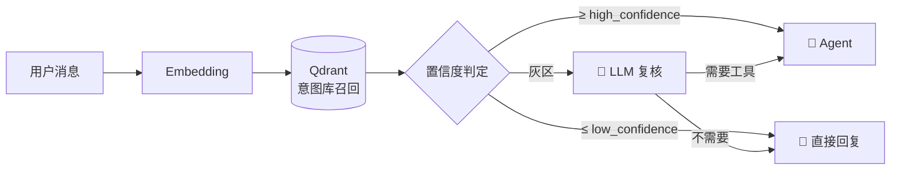
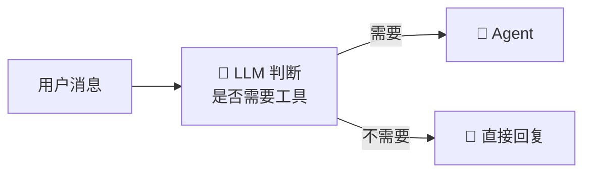

# 🎯 意图路由

> Selena 收到一条消息后，第一个要回答的问题是 —— **这一句要不要启动 Agent？**

---

## 1. 为什么需要意图路由？

完整的 Agent 主循环涉及工具规划、工具调用、结果整合，**贵且慢**。但用户的大部分消息只是闲聊：

> "今天天气不错。"
> "嗯。"
> "你怎么看?"

让这些消息走完整 Agent 流程是巨大的浪费。意图路由解决的就是 —— **快速判断哪些消息真的需要工具**。

---

## 2. 两种工作模式

`config.json` 中 `IntentRouter.method` 控制策略：

### 模式 A：`vector`（向量模式 + 灰区复核）



**适合**：你已经为常见意图准备好了示例库，希望 90% 的消息毫秒级判定。

### 模式 B：`llm`（纯 LLM 模式）



**适合**：意图分布多变、没有时间维护意图库时。简单粗暴，但每条消息都多花一次小模型调用。

---

## 3. 关键参数（vector 模式）

```json
{
  "IntentRouter": {
    "method": "vector",
    "enabled": true,
    "high_confidence_threshold": 0.78,
    "low_confidence_threshold": 0.55,
    "candidate_limit": 4,
    "llm_fallback": {
      "enabled": true,
      "model": "qwen_flash",
      "thinking": false,
      "json_mode": true
    }
  }
}
```

### 三个阈值说明

| 阈值 | 含义 | 行为 |
|------|------|------|
| `high_confidence_threshold` | 高置信线 | 召回最高分 ≥ 此值 → **直接进 Agent** |
| `low_confidence_threshold` | 低置信线 | 召回最高分 ≤ 此值 → **直接走 RAG / Reply** |
| 中间灰区 | 0.55 ~ 0.78 | 交给 `llm_fallback` 模型复核 |

### candidate_limit

灰区复核时送给 LLM 的候选意图数量。给得越多，LLM 越能精确判断"和哪个意图最像"，但 token 消耗也越大。

---

## 4. 意图库怎么来？

意图库是一个 Qdrant collection（默认名 `IntentionSelection_512`），里面每条记录是一个意图示例：

```json
{
  "id": "uuid",
  "vector": [...],
  "payload": {
    "intent": "create_schedule",
    "example": "明天早上 9 点提醒我开会",
    "skill": "schedule-manager"
  }
}
```

意图示例的两种来源：

### ① Skill manifest 自带 `intent_examples`

每个 skill 的 `manifest.json` 可以声明它的代表意图：

```json
{
  "name": "schedule-manager",
  "intent_examples": [
    "明天提醒我...",
    "帮我安排个日程...",
    "查一下我下周有什么任务..."
  ]
}
```

启动时这些示例会被自动写入意图库。

### ② 自动生成（Prompt 见 `MdFile/intent/IntentionExamplePrompt.md`）

对于已有 skill 但示例不够的，系统可以让 LLM 围绕 skill 描述自动生成多样化示例。

---

## 5. 灰区复核的 Prompt

LLM 复核阶段使用的提示词位于 `MdFile/intent/LLMIntentRouterPrompt.md`。它会让模型：

1. 读取用户最新消息。
2. 看候选意图列表（vector 召回 Top-N）。
3. 输出 JSON 决策：
   ```json
   {
     "needs_tool": true,
     "matched_intent": "create_schedule",
     "confidence": 0.83
   }
   ```

`json_mode = true` 是必须的，因为代码会直接解析这个结构。

---

## 6. 一个具体例子

假设用户输入："明天早上提醒我去机场"

### vector 模式追踪
```
1. Embedding(用户消息) → 512 维向量
2. Qdrant.search(vector, top_k=4) →
   [
     ("明天提醒我开会",     0.91, schedule-manager),
     ("帮我设置一个闹钟",   0.83, schedule-manager),
     ("发起会议邀请",        0.62, ...),
     ("订机票",             0.51, ...)
   ]
3. 最高分 0.91 ≥ 0.78（high_confidence）
4. → 直接启动 Agent，预热 schedule-manager skill
```

### llm 模式追踪
```
1. 调用 qwen_flash with json_mode
2. 输入：用户消息 + 系统能力清单
3. 输出：{"needs_tool": true, "reason": "用户请求设置时间提醒"}
4. → 启动 Agent
```

---

## 7. 调参建议

| 你想要 | 怎么调 |
|--------|--------|
| 减少误启动 Agent | 调高 `high_confidence_threshold`（如 0.82） |
| 减少错过工具调用 | 调低 `low_confidence_threshold`（如 0.50） |
| 灰区少一些（更激进） | 两个阈值靠近 |
| 灰区多一些（更稳） | 两个阈值拉开 |
| 完全跳过向量 | `method = "llm"` |
| 完全跳过路由 | `enabled = false`（每条消息都走 Agent，**不推荐**） |

---

## 8. 与其他系统的边界

意图路由**只判断**"要不要 Agent"，不判断"要用哪个工具"：
- 工具具体选择是 Agent 主循环的职责（让模型自己挑）。
- 意图路由只是决定走哪条主链路。

这个分工避免了"路由层和 Agent 层重复推理"。

---

## 9. 相关文档

- [Agent 主循环](./agent-loop.md)
- [技能系统](./skill-system.md) — `intent_examples` 字段
- [分层记忆系统](./memory-system.md) — 意图库本身就是一个向量集合
