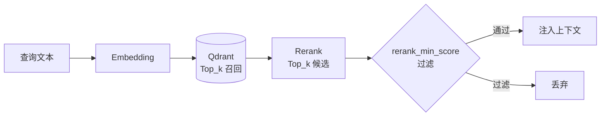

# 🧠 分层记忆系统

> Selena 的记忆不是"把所有东西塞进一个大向量库"。它分**四层**，每层各有任务，又彼此衔接。

---

## 1. 为什么分层？

LLM 上下文窗口有限，长期对话总要"忘"。但什么该忘、什么该记，是个工程问题。

Selena 的分层策略：

| 层级 | 类比 | 时效 | 注入位置 |
|------|------|------|---------|
| 静态角色提示词 | 一个人的**性格** | 永恒 | 系统 prompt 顶部 |
| **关键记忆 ContextMemory** | 一个人的**长期信念** | 跨会话 | 系统 prompt 中部，always visible |
| **当前话题上下文** | **工作记忆** | 当前 topic 内 | 用户消息前的最近若干轮 |
| **话题档案 Topic Archive** | **片段式回忆** | 跨 topic 但同主题 | 命中相关性时召回 |
| **长期向量记忆** | **语义性长期记忆** | 永久（带 TTL） | 通过工具 / 主动检索召回 |

四层的关系不是"取代"，而是**层叠协作**。

---

## 2. ContextMemory（关键记忆）

`ContextMemory` 是 Selena 记忆系统中最特别的一层 —— 它**不是检索出来的**，而是**始终可见**的一段精炼描述。

### 设计目标
让 LLM 在每一轮回复时都"自然知道"一些不该忘的信息：你的名字、你的偏好、你最近的状态。

### 它长什么样
通常是几条短句，按 section 分类，渲染到 prompt 系统区：

```
【用户的近况】
- 在准备下周的成都出差
- 担心降温，已经买了薄外套

【用户的偏好】
- 不喜欢被夸"聪明"，喜欢被夸"细心"
- 早上 10 点前不爱讨论复杂话题
```

### 关键参数

| 参数 | 含义 |
|------|------|
| `update_trigger` | 何时重写：`assistant_turn`（每轮）/ `topic_switch`（话题切换）/ `topic_switch_or_interval`（折中） |
| `update_min_new_messages` | interval 模式下累积多少条新消息触发 |
| `update_on_empty` | 空记忆时是否冷启动写第一版 |
| `max_chars` | 全部记忆的字符上限（≈ token 约束） |
| `max_items_total` | 总条目数上限 |
| `max_items_per_section` | 每个 section 默认条数 |
| `max_item_chars` | 单条字符上限 |
| `recent_message_limit` | 重写时回看多少条历史 |

### 推荐配置
- `update_trigger = "topic_switch"`：避免每轮都改写，否则 always-visible 的内容一直跳，模型会困惑。
- `max_chars` 建议 1500–2500 之间，太大会挤压有效上下文。

> 详见 `memory/ChatContext.py` 与 `MdFile/memory/CoreMemoryUpdatePrompt.md`。

---

## 3. 当前话题上下文（Live Context）

主循环维护的"最近若干轮原始消息"，按 **topicGroup** 切分。

### 话题切分逻辑
每条新消息会让 `topic_same` 模型判断"还属于同一话题吗"：
- **同话题**：追加到当前 group。
- **不同话题**：开新 group，触发**话题归档**。

### 上下文压缩
当 live context 超过 `Summary.Max_context` 条时，主循环会调用 `context_summary` 模型把前面的部分压缩成摘要，仅保留最近 `Summary.Summary_context` 条原始消息。

> 详见 `memory/topic_history.py` 与 `MdFile/topic/TopicPrompt.md`。

---

## 4. 话题档案 Topic Archive

旧话题被归档时会经历两步：

1. **生成摘要** — 用 `topic_archive_summary` 模型对整个 topicGroup 写一段话题级摘要。
2. **落盘** — 摘要 + 原始 jsonl 都保留在 `history/`。

档案是**可检索的**：当未来的对话出现相关线索时，可以通过工具或主动召回找回旧话题摘要。

档案的价值在于**保留语境**而非细节 —— 你不需要逐字记得三个月前讨论过什么，但应该记得"那次我们聊过类似的事"。

> 详见 `memory/history_summary_worker.py`。

---

## 5. 长期向量记忆

最底层的"原子记忆"。每条记忆是一个独立的、可检索的语义单元，存在 Qdrant 中。

### 写入路径
- **主动写入**：模型通过 `storeLongTermMemory` 工具显式存储。
- **后台抽取**：每轮对话后，后台 worker 自动从对话中提取值得长期记忆的语义点。

### 检索路径
- **工具调用**：模型通过 `searchLongTermMemory` 主动查询。
- **意图路由命中**：`vector` 模式下，意图库本身也是一个 collection。
- **RAG 注入**：相关性高时直接拼到上下文。

### 每条记忆的元数据

| 字段 | 含义 |
|------|------|
| `vector` | Embedding 向量 |
| `content` | 原始文本 |
| `temperature` | 温度（hot / warm / cold） |
| `importance` | 重要度评分 |
| `search_score` | 累计被命中的得分 |
| `ttl` | 存活时间 |
| `created_at` / `accessed_at` | 时间戳 |

### 温度与衰减机制
记忆不是"存了就永远在"。Selena 用三个机制管理记忆生命周期：

#### ① 温度
- **Hot**：最近频繁被命中，权重最高。
- **Warm**：偶尔被命中。
- **Cold**：长期未被命中，权重下降但不立即删除。

每次检索命中会让 `search_score` +1，达到上限 (`Max_SearchScore`) 后封顶，避免单条记忆无限膨胀。

#### ② TTL 升降级
TTL 到期时，根据 `search_score` 决定命运：

```
search_score ≥ Upgrade_Score_Threshold  → 升级，TTL × Upgrade_TTL_Multiplier
search_score ≤ Downgrade_Score_Threshold → 降级，TTL × Downgrade_TTL_Multiplier
重要度 ≥ Importance_Threshold            → 保护，不删除
```

#### ③ 去重
新记忆写入前会检查与已有记忆的向量相似度，超过 `Duplicate_Vector_Threshold` 视为重复，合并而非新增。

### 检索流程



> 详见 `memory/memory_storage.py`，参数全部在 `config.json` 的 `VectorSetting` 与 `MemoryRecall` 区。

---

## 6. 关键参数总览

```json
{
  "ContextMemory": {
    "enabled": true,
    "update_trigger": "topic_switch",
    "max_chars": 2200,
    "max_items_total": 14
  },
  "Summary": {
    "Max_context": 100,
    "Summary_context": 70,
    "Agent_Max": 6
  },
  "VectorSetting": {
    "Top_k": 12,
    "Importance_Threshold": 0.85,
    "Max_SearchScore": 5,
    "Temperature_Weight": { "hot": 1.0, "warm": 0.7, "cold": 0.4 },
    "Default_TTL_Days": 30,
    "Upgrade_Score_Threshold": 3,
    "Downgrade_Score_Threshold": 1,
    "Upgrade_TTL_Multiplier": 2,
    "Downgrade_TTL_Multiplier": 0.5,
    "Duplicate_Vector_Threshold": 0.92,
    "Rerank_Top_k": 8,
    "Rank_Score": 0.4
  },
  "MemoryRecall": {
    "rerank_min_score": 0.45
  }
}
```

字段含义详见 [`CONFIG_REFERENCE.md`](../CONFIG_REFERENCE.md#vectorsetting)。

---

## 7. 调参建议

| 你想要 | 怎么调 |
|--------|--------|
| 让记忆更"健忘"（节省存储） | 调低 `Default_TTL_Days`，调高 `Downgrade_Score_Threshold` |
| 让记忆更"长情" | 调高 `Importance_Threshold`，调高 `Upgrade_TTL_Multiplier` |
| 召回更精准 | 调高 `MemoryRecall.rerank_min_score` |
| 召回更宽松 | 调高 `VectorSetting.Top_k`，调低 `Rank_Score` |
| 关键记忆别老变 | `update_trigger = "topic_switch"` |
| 关键记忆永远是新版 | `update_trigger = "assistant_turn"` |

---

## 8. 相关文档

- [意图路由](./intent-routing.md) — 意图库本身也是一个向量集合
- [自主任务模式](./autonomous-mode.md) — 自主经历也会进入记忆
- [整体架构](./architecture.md)
