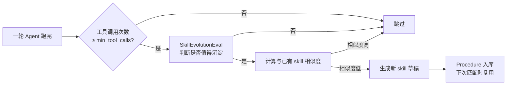

# 🛠️ 技能系统

> Selena 的技能（Skill）= **manifest + tools + 可选 runtime + 提示词**。它是模块化扩展能力的标准单位。

---

## 1. Skill vs Tool

| 概念 | 是什么 | 例子 |
|------|--------|------|
| **Tool** | 单个原子能力 | `webSearch`、`readLocalFile`、`browserClick` |
| **Skill** | 一组围绕同一目标的工具 + 元信息 | `chrome-browser-agent`（13 个浏览器工具）|

意图路由命中某个 skill 时，会**预热它的工具**让 Agent 优先选择，但不会强制。

---

## 2. 内置 9 大技能

### 🌐 chrome-browser-agent
**控制可见 Chrome 浏览器**，导航、点击、截图、跨标签页协调。

| 工具 | 作用 |
|------|------|
| browserNavigate / browserSearch | 跳转 / 搜索 |
| browserSnapshot / browserScreenshot | 文本快照 / 图片截图 |
| browserClick / browserType / browserPressKey | 交互 |
| browserScroll / browserWait / browserGoBack | 页面控制 |
| browserListTabs / browserSelectTab / browserCloseTab | 多标签页 |

详见 [浏览器代理](./browser-agent.md)。

---

### 🌐+ browser-enhancements
**浏览器辅助技能**，用于增强默认浏览器工具。

| 工具 | 作用 |
|------|------|
| browserOpenTab | 在新标签页打开（不替换当前页）|
| browserExtractPage | 提取大段页面文本 |
| browserReadLinkedPage | 读取页面中的链接目标 |

---

### 🔎 web-access
**联网搜索**，使用 Kimi 内置 Web Search 能力。

| 工具 | 作用 |
|------|------|
| searchWeb | 搜索全网最新信息 |

> ⚠️ 这是检索文本知识的**首选**。需要交互式操作页面才用 `chrome-browser-agent`。

---

### 📅 schedule-manager
**日程任务管理**，本地 SQLite 存储。

| 工具 | 作用 |
|------|------|
| createScheduleTask | 创建提醒 |
| queryScheduleTasks | 查询任务列表 |
| updateScheduleTask | 修改任务 |
| deleteScheduleTask | 删除任务 |

到点会有提醒（终端 + 前端通知）。

---

### 👥 subagent-manager
**子代理委派**，把任务交给隔离的 sub-agent 执行。

| 工具 | 作用 |
|------|------|
| delegateTask | 委派单个任务 |
| delegateTasksParallel | 并行委派多个任务 |
| waitForDelegatedTasks | 等待批量结果 |
| continueDelegatedTask / cancelDelegatedTask | 续聊 / 取消 |
| listDelegatedTasks / getDelegatedTaskStatus | 状态查询 |

详见 [子代理委派](./subagent-delegation.md)。

---

### 🧰 skill-manager
**技能自管理**：让 Selena 自己 CRUD skill。

| 工具 | 作用 |
|------|------|
| listSkills | 列出已安装 |
| manageSkill | 启用 / 禁用 / 修改 |
| deleteSkill | 删除 |
| importSkill / exportSkill | 导入 / 导出 |
| browseSkillMarketplace | 浏览市场 |

---

### 📄 document-generation
**生成 PDF / Word / PPT 文档**。

| 工具 | 作用 |
|------|------|
| generateDocument | 根据结构化内容生成文档 |

依赖可选包：`python-docx`、`python-pptx`。PDF 生成通过纯 Python 实现。

典型场景：
```
用户：把刚才的研究结果做成 PPT。
→ Agent: generateDocument(format="pptx", sections=[...])
```

---

### 🔍 atm-memory-inspector
**自主任务产物检视器**：当用户问"你今天做了什么/写了什么"时，从 ATM (Autonomous Task Memory) 中找出真实存储的产物（诗歌、随笔等）。

| 工具 | 作用 |
|------|------|
| searchAutonomousTaskArtifacts | 搜索自主任务历史 |
| readAutonomousTaskArtifact | 读取具体产物原文 |

> 这个 skill 解决的问题：让 Selena 不能"假装记得自己写过什么"，必须读真实记录。

---

### 🩺 system-diagnostics
**系统日志诊断**。

| 工具 | 作用 |
|------|------|
| getSelfLog | 读取当前运行时日志，排查问题 |

---

## 3. Skill 文件结构

```
skills/<skill-name>/
├─ manifest.json         # 元信息（必须）
├─ SKILL.md              # 给 LLM 看的使用说明（必须）
├─ runtime.py            # 可选：trusted runtime 实现
├─ tools/                # 工具定义（JSON）
│   ├─ tool1.json
│   └─ tool2.json
└─ assets/               # 可选：模板、字体、参考资料
```

### manifest.json

```json
{
  "name": "schedule-manager",
  "version": "1.0.0",
  "enabled": true,
  "runtime_mode": "trusted",
  "trusted_runtime": true,
  "description": "Create, query, update, and delete user schedule tasks",
  "when_to_use": [
    "Use this skill when the user asks to create a reminder...",
    "Use this skill when the user wants to view, modify..."
  ],
  "when_not_to_use": [
    "Do NOT use this skill when..."
  ],
  "intent_examples": [
    "明天提醒我开会",
    "帮我安排个日程"
  ]
}
```

### SKILL.md
给模型看的"详细说明书"。Selena 在意图命中时会把这个文件的内容注入到 prompt 中，告诉模型：

- 这个 skill 解决什么场景
- 它的工具应该怎么组合使用
- 常见的反模式（应避免的用法）

写好 SKILL.md 是让 skill 真正能用的关键。

---

## 4. 运行时模式 `runtime_mode`

| 模式 | 含义 |
|------|------|
| `trusted` | 由 Selena 的 Python runtime 直接调用 `runtime.py`，性能最佳 |
| `subprocess` | 在隔离进程中运行（仅在需要强隔离时使用）|
| `builtin` | LLM 供应商自带能力（如 Kimi web search），不需要本地实现 |

`web-access` 用 `builtin`，因为它走的是 Kimi 的内置 web search 接口。

---

## 5. 技能演化（SkillEvolution）

> Selena 不仅"使用"技能，还会"学习"新技能 —— 把重复出现的工具流程沉淀成一个新 skill。

### 工作原理



### 关键参数
```json
{
  "SkillEvolution": {
    "enabled": true,
    "min_tool_calls": 3,
    "similarity_threshold": 0.7
  }
}
```

- `min_tool_calls`：少于此次数的工具流程不考虑沉淀（避免噪音）。
- `similarity_threshold`：和已有 skill 太像就不重复创建，避免泛滥。

### Procedure：技能演化的中间产物
新沉淀的"流程"会先以 Procedure 形式存在，由 `searchLearnedProcedures` 工具召回。当某个 Procedure 被验证为稳定、好用，可以通过 `promoteLearnedProcedureToSkill` 工具升级为正式 skill。

---

## 6. 编写自己的 Skill

### 最小例子

```bash
mkdir -p skills/my-skill/tools
```

**`skills/my-skill/manifest.json`**
```json
{
  "name": "my-skill",
  "version": "1.0.0",
  "enabled": true,
  "runtime_mode": "trusted",
  "description": "My custom skill",
  "when_to_use": ["Use when user asks for X"],
  "intent_examples": ["帮我做 X"]
}
```

**`skills/my-skill/SKILL.md`**
```markdown
# my-skill

When the user asks to do X, use the `myTool` tool with...
```

**`skills/my-skill/tools/myTool.json`**
```json
{
  "name": "myTool",
  "description": "Do X",
  "parameters": {
    "type": "object",
    "properties": {
      "arg": { "type": "string" }
    },
    "required": ["arg"]
  }
}
```

**`skills/my-skill/runtime.py`**
```python
def myTool(arg: str) -> str:
    return f"Hello {arg}"
```

重启 Selena 即生效。

---

## 7. 相关文档

- [Agent 主循环](./agent-loop.md) — 工具如何被规划与调用
- [意图路由](./intent-routing.md) — `intent_examples` 怎么用
- [安全策略](./security-policy.md) — toolset 与权限
- [子代理委派](./subagent-delegation.md) — 一个完整 skill 的例子
- [浏览器代理](./browser-agent.md) — 另一个完整 skill 的例子
