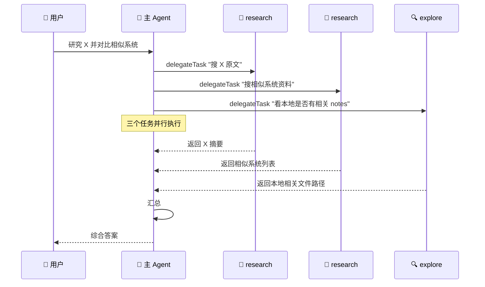

# 👥 子代理委派

> 主 Agent 处理复杂任务时，可以把"子任务"委派给隔离的 sub-agent，**并行**或**串行**执行。这是 Selena 处理多线索任务的核心机制。

---

## 1. 为什么要子代理？

主 Agent 在长链路任务里会遇到三个问题：

1. **上下文爆炸** —— 一个调研任务塞进去，主对话就被检索结果挤满。
2. **无法并行** —— 单 Agent 是串行的，但很多子任务彼此独立。
3. **失败传染** —— 子任务挂了会污染主上下文。

子代理委派把每个子任务放进**独立 Runtime**，主 Agent 只看到一个汇总结果。

---

## 2. 六种内置类型

| 类型 | 角色 | 特点 |
|------|------|------|
| **general** | 通用型 | 兼顾记忆、浏览器、日程、文件读取 |
| **explore** | 探索型 | 偏重快速定位文件，**禁写、禁网络** |
| **research** | 研究型 | 高读取、高网络配额，适合综合调研 |
| **plan** | 规划型 | 偏方案设计与结构化输出 |
| **review** | 审查型 | 高读取、低写入、**禁网络**，适合代码审查 |
| **test** | 测试型 | 允许少量写入，适合跑测试与生成验证产物 |

每种类型在 `agents/<name>.md` 中以 frontmatter + system prompt 定义：

```yaml
---
name: research
description: Research-focused subtask agent
max_tool_calls: 12
toolsets:
  - core
  - memory
  - browser
  - file_read
resource_limits:
  max_file_reads: 80
  max_file_writes: 0
  max_network_calls: 30
---

You are a research-focused sub-agent...
```

修改这些 md 文件即可调整行为。

---

## 3. 委派方式

### 单任务委派

```
delegateTask(
  agent_type="research",
  task="对比 Mamba 与 Transformer 的性能基准",
  context="需要 2024 年后的论文与社区基准",
  expected_output="一段 500 字以内的总结，附引用"
)
→ 返回 task_id
```

### 并行 fan-out

```
delegateTasksParallel(tasks=[
  { "agent_type": "research", "task": "搜原始论文..." },
  { "agent_type": "research", "task": "搜社区 benchmark..." },
  { "agent_type": "explore",  "task": "看本地是否有相关笔记..." }
])
→ 返回 [task_id_1, task_id_2, task_id_3]
```

### 等待结果

```
waitForDelegatedTasks([id1, id2, id3], timeout=120)
→ 阻塞等待，返回所有完成结果
```

### 续聊

```
continueDelegatedTask(task_id, message="再深入查一下 Mamba 的训练成本")
→ 让同一个 sub-agent 继续工作
```

### 状态查询 / 取消

```
getDelegatedTaskStatus(task_id)
listDelegatedTasks()
cancelDelegatedTask(task_id)
```

---

## 4. 资源配额

每种 agent 类型都有独立配额，主要在 `SubAgentPolicy.agent_type_configs.<type>.resource_limits`：

| 字段 | 含义 |
|------|------|
| `max_file_reads` | 最多读多少个文件 |
| `max_file_writes` | 最多写多少个文件 |
| `max_network_calls` | 最多发多少次网络请求 |

`max_tool_calls` 单独控制工具调用总数。

### 全局配额

```json
{
  "SubAgentPolicy": {
    "max_depth": 1,
    "allow_admin_tools": false,
    "max_concurrent_tasks": 2,
    "max_queue_size": 16,
    "result_cache_enabled": true,
    "result_cache_ttl_seconds": 600,
    "result_cache_max_entries": 64
  }
}
```

| 字段 | 含义 |
|------|------|
| `max_depth` | sub-agent 是否能继续创建 sub-agent（默认 1，即不允许递归）|
| `allow_admin_tools` | sub-agent 能否使用管理员级工具（默认 false）|
| `max_concurrent_tasks` | 同时运行的委派任务最大数 |
| `max_queue_size` | 等待队列上限 |
| `result_cache_*` | 委派结果缓存 |

---

## 5. 工具集白名单

每个 agent 类型有自己的 `toolsets` 字段，决定它能用哪些工具集。例如 `explore`：

```yaml
toolsets:
  - core
  - memory
  - file_read
disallowed_tools:
  - askUser
  - resolveToolApproval
  - delegateTask
  - storeLongTermMemory
```

`disallowed_tools` 是更细粒度的禁止 —— 即使 toolset 启用，特定工具也不允许用。

---

## 6. 一个真实的并行例子



主 Agent 的 token 消耗 = 三个简单的 delegateTask 调用 + 一段汇总，**远小于自己跑完整调研**。

---

## 7. 结果缓存

`SubAgentPolicy.result_cache_enabled = true` 时，相似的委派任务会复用结果（10 分钟 TTL）：

- 命中条件：agent_type 相同 + task 描述高度相似。
- 适合"同一会话内反复问类似问题"的场景。

---

## 8. 自定义 Agent 类型

想要一个新的 agent 类型？在 `agents/` 加个 md：

**`agents/translator.md`**
```yaml
---
name: translator
description: Translation specialist
max_tool_calls: 4
toolsets:
  - core
  - memory
  - file_read
resource_limits:
  max_file_reads: 5
  max_file_writes: 0
  max_network_calls: 0
---

You are a translation sub-agent. Translate the given content
preserving tone and technical accuracy. Do not add commentary.
```

重启 Selena 后，主 Agent 就能用 `delegateTask(agent_type="translator", ...)` 了。

---

## 9. 自主任务模式中的子代理

[自主任务模式](./autonomous-mode.md)用一个特殊的 `autonomous` agent 类型 —— 没有用户在场，所以 `disallowed_tools` 包含所有"需要询问 / 需要审批"的工具。

详见 `agents/autonomous.md`。

---

## 10. 相关文档

- [Agent 主循环](./agent-loop.md) — 主 Agent 怎么调用子代理
- [自主任务模式](./autonomous-mode.md) — 自主任务用的特殊 agent 类型
- [安全策略](./security-policy.md) — toolset 与 disallowed_tools 的执行
- [技能系统](./skill-system.md) — subagent-manager skill 的实现
